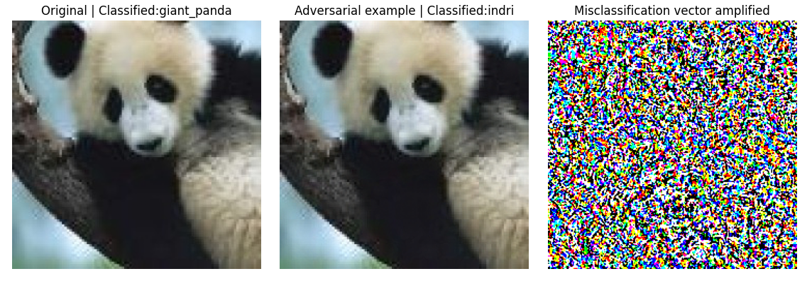

# Fast gradient sign method

An Proof of Concept implementing the method for the creation of adversarial examples proposed in the [EXPLAINING AND HARNESSING ADVERSARIAL EXAMPLES](https://arxiv.org/pdf/1412.6572.pdf)

## Results

